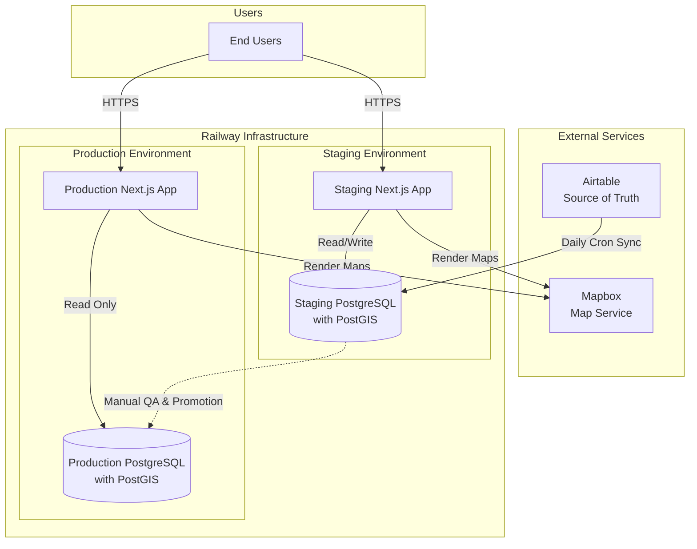

# SA Circular Directory — Architecture & Data Flow

## Guiding Principles

- **Affordable** — avoid services with monthly fees where possible; prefer usage-based or free tiers
- **Accessible** — no technical learning curve for contributors managing data; Airtable UI is the control surface
- **Simple** — minimal moving parts, clear promotion path from staging → production
- **AI-assisted** — leverage AI for sync logic, data mapping, and QA tooling where it reduces manual work

---

## Tech Stack

| Layer | Tool | Why |
|---|---|---|
| Data source of truth | Airtable | Non-technical team can manage data via UI |
| App database | PostgreSQL + PostGIS (Railway) | Free on Railway hobby plan; PostGIS enables future map queries |
| ORM / schema | Prisma | Works seamlessly with Next.js and tRPC; generates typed client |
| API layer | tRPC | End-to-end type safety without REST boilerplate; works great in Next.js monorepo |
| Frontend + backend | Next.js (App Router) | Monorepo — one repo, one deploy per environment |
| Infrastructure | Railway | Git-based deploys, managed Postgres, environment support, no monthly fee on hobby |
| Maps | Mapbox | Render location data on the frontend |

---

## System Architecture



---

## Environments

| | Staging | Production |
|---|---|---|
| **Trigger** | Push to `main` branch | Git tag release (e.g. `v1.0.0`) |
| **Database** | Staging PostgreSQL | Production PostgreSQL |
| **Airtable sync** | Daily cron + on-demand command | Promoted from staging only |
| **Purpose** | QA & verification | Live to end users |

### Deploy flow
```
Airtable UI (data changes)
  └── Daily cron job → Staging DB
        └── QA passes → Manual promotion → Production DB
                            └── Git tag → Production App deploys
```

---

## Airtable

- **Base:** `apppd7CyLPeDWBkLz`
- **Table:** `production db` — [API docs](https://airtable.com/apppd7CyLPeDWBkLz/api/docs#javascript/table:production%20db)
- **Public view:** https://airtable.com/apppd7CyLPeDWBkLz/shr140tfRWSm18pIU/tbl1OiPqIAHz1jbqc
- **Token:** stored in Railway env var `AIRTABLE_TOKEN` — do not hardcode

Airtable is **read-only from the app's perspective.** All data edits happen in Airtable. The sync job pulls from Airtable and writes to the staging PostgreSQL database.

---

## Data Sync

### Staging sync (Airtable → Staging DB)
- Runs on a **daily cron schedule** (e.g. midnight CT)
- Can also be **triggered on demand** via a script or API route: `POST /api/admin/sync`
- Sync logic: fetch all records from Airtable API → upsert into PostgreSQL via Prisma

### Production promotion (Staging DB → Production DB)
- **Manual step** — run after QA sign-off
- Script: `npm run db:promote` (pg_dump staging → pg_restore production)
- Never auto-promoted; always a deliberate human decision

---

## Where AI Makes Sense

| Task | AI Opportunity |
|---|---|
| Airtable → Prisma schema mapping | Claude can generate/update Prisma schema from Airtable field definitions |
| Sync script logic | Claude writes and maintains the upsert logic as Airtable schema evolves |
| QA diffing | Claude can compare staging vs. production record counts / field changes before promotion |
| Component generation | Claude builds UI components from Figma designs using design tokens (see CLAUDE.md) |
| Data cleanup | Claude can flag Airtable records with missing required fields before sync |

---

## Monorepo Structure (planned)

```
sa-circular-directory-app/
  src/
    app/              # Next.js App Router pages
    components/       # UI components
    server/
      routers/        # tRPC routers
      db/             # Prisma client + queries
    lib/              # Shared utilities (sync job, Airtable client, etc.)
  prisma/
    schema.prisma     # Database schema
  scripts/
    sync.ts           # Airtable → DB sync (run via cron or on-demand)
    promote.ts        # Staging → Production DB promotion
  docs/
    architecture.md   # This file
```

---

## Railway Setup

- Project: `just-recreation`
- Environments: `staging`, `production`
- Services per environment: `sa-circular-directory-app` (Next.js), `Postgres`
- Env vars managed in Railway dashboard — never committed to the repo
