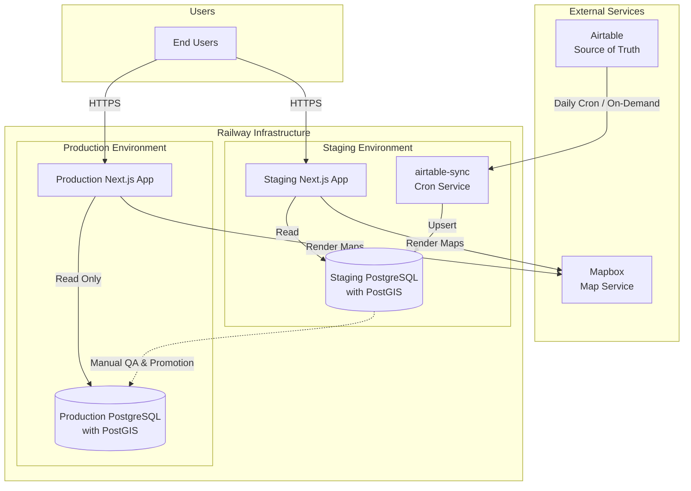

# SA Circular Directory — Architecture & Data Flow

## Guiding Principles

- **Affordable** — avoid services with monthly fees where possible; prefer usage-based or free tiers
- **Accessible** — no technical learning curve for contributors managing data; Airtable UI is the control surface
- **Simple** — minimal moving parts, clear promotion path from staging → production
- **AI-assisted** — leverage AI for sync logic, data mapping, and QA tooling where it reduces manual work

---

## Tech Stack

| Layer | Tool | Why |
|---|---|---|
| Data source of truth | Airtable | Non-technical team can manage data via UI |
| App database | PostgreSQL (Railway) | Free on Railway hobby plan |
| ORM / migrations | Prisma (v7, `prisma-client` provider + `@prisma/adapter-pg`) | Type-safe queries, `prisma migrate dev` generates SQL migrations |
| Schema authority | `src/lib/schema/` — Zod schemas + field mappings | Single source of truth for Airtable field names, DB column names, and the mapping between them |
| Frontend + backend | Next.js (App Router) | Monorepo — one repo, one deploy per environment |
| Infrastructure | Railway | Git-based deploys, managed Postgres, environment support, no monthly fee on hobby |
| Maps | Mapbox | Render location data on the frontend |

---

## System Architecture



---

## Environments

| | Staging | Production |
|---|---|---|
| **Trigger** | Push to `main` branch | Merge `main` → `production` branch |
| **Database** | Staging PostgreSQL | Production PostgreSQL |
| **Airtable sync** | Daily cron + manual via Railway dashboard "Deploy Now" | Promoted from staging only |
| **Purpose** | QA & verification | Live to end users |

### Deploy flow
```
Airtable UI (data changes)
  └── Daily cron job (airtable-sync service, 0 6 * * * UTC) → Staging DB
        └── QA passes on staging → merge main → production branch
                          └── Railway builds production app (~3-5 min)
                                └── Pre-deploy: scripts/promote-db.sh
                                      ├── pg_dump staging DB (~15s)
                                      └── pg_restore production DB (~30s, blocks existing queries)
                                            └── ✅ Success → traffic switches to new app
                                            └── ❌ Failure → old deployment stays live
```

**Release workflow:**
```bash
git checkout main && git pull
git checkout production && git merge main && git push origin production
# Optionally tag for version tracking: git tag v1.0.0 && git push origin v1.0.0
```

---

## Airtable

- **Base ID:** `apppd7CyLPeDWBkLz`
- **Primary table:** `Production DB` (table ID: `tblujaqw04RqX2j3P`)
- **Env var:** `AIRTABLE_API_KEY` (stored in Railway, never hardcode)
- **Env var:** `AIRTABLE_BASE_ID` = `apppd7CyLPeDWBkLz` (stored in Railway)

Airtable is **read-only from the app's perspective.** All data edits happen in Airtable. The sync job pulls from Airtable and writes to the staging PostgreSQL database.

### Airtable tables synced

| Airtable Table | Postgres Table | Notes |
|---|---|---|
| `Production DB` | `businesses` | Main listing records |
| `Business Actions` | `business_actions` | Has `Corresponding Action` (user-facing label), `Order for Display` (sort order), `Icon to Use` (SVG icon key), and `Colorway` (color family token) |
| `Categories` | `categories` | Has `Items` (comma-separated item strings) and `FA Icon` (Font Awesome icon name, no prefix) |
| `Business Type` | `business_types` | |
| `Core Material System` | `core_material_systems` | |
| `Enabling Systems` | `enabling_systems` | |
| `Tag` | `tags` | |
| `Business Activity` | `business_activities` | |

### Known Airtable field quirks

- **`Listing Photo`** — stored as a plain URL string (not an Airtable attachment array). Extract directly: `f['Listing Photo']`, not `f['Listing Photo'][0].url`.
- **`Business Descriptios`** — typo in Airtable field name ("Descriptios", not "Description"). Documented as-is in the Zod schema; fix in Airtable when ready, then update `src/lib/schema/airtable.ts` and `src/lib/schema/mapping.ts`.
- **`Business Actions` → `Action` field** — stores the business-perspective label (e.g. "Accepts Dropoff", "Sells"). The `Corresponding Action` field stores the user-facing label (e.g. "Donate", "Buy"). The app maps between them via `src/lib/actionMapping.ts`.
- **All field names are canonical in `src/lib/schema/`** — if you find a mismatch between what Airtable sends and what the sync uses, `src/lib/schema/airtable.ts` is the first place to look.

---

## Data Sync

### How it works

Sync logic lives in `src/lib/sync.ts` and is called by one active entry point:

| Entry point | When to use |
|---|---|
| `scripts/sync.ts` + `npm run sync` | Railway Cron service (primary), or local testing |

The sync fetches all 8 Airtable tables into memory, validates each record against its Zod schema (invalid records are logged and skipped — no silent null inserts), upserts lookup tables in parallel via Prisma Client, upserts businesses, then geocodes any un-geocoded addresses via the Mapbox Geocoding API. All upserts use Prisma's `upsert()` (conflict on `airtable_id`) so re-running is safe.

### Shared schema module (`src/lib/schema/`)

This is the single source of truth for all Airtable ↔ DB field name mappings:

| File | Purpose |
|---|---|
| `src/lib/schema/tables.ts` | Airtable table names and IDs (both `name` and `id` per table) |
| `src/lib/schema/airtable.ts` | Zod schemas per entity — matches exact Airtable field names, including known typos |
| `src/lib/schema/mapping.ts` | Maps Airtable field names → Prisma model field names for each entity |
| `src/lib/schema/index.ts` | Barrel export |

**Adding a new field:**
1. Add the field to `src/lib/schema/airtable.ts`
2. Add the mapping in `src/lib/schema/mapping.ts`
3. Wire it into the Prisma upsert in `src/lib/sync.ts`
4. Run `npx prisma migrate dev --name add_<field>` to generate the SQL migration
5. TypeScript errors surface everywhere the field needs to be handled


### Railway Cron service (`airtable-sync`)

- **Service name:** `airtable-sync` (ID: `1ae4e62e-9793-4678-a2e5-858efe4aeb47`)
- **Schedule:** `0 6 * * *` (6am UTC = midnight CT)
- **Start command:** `npm run sync`
- **Manual trigger:** click **"Deploy Now"** in the Railway dashboard on the `airtable-sync` service
- **Env vars required:** `DATABASE_URL`, `AIRTABLE_API_KEY`, `AIRTABLE_BASE_ID`, `MAPBOX_SECRET_TOKEN`, `NODE_ENV=production`

> **`NODE_ENV=production` is required** on the cron service so `src/lib/db.ts` enables SSL on the `pg.Pool` that backs the Prisma adapter.

### Production promotion (Staging DB → Production DB)

- **Trigger** — Merge `main` → `production` branch; always a deliberate human action
- **Automated via Railway pre-deploy** — `scripts/promote-db.sh` runs as the pre-deploy command on the production `sa-circular-directory-app` service; if it fails, the deployment is aborted and the old version stays live
- **Manual fallback** — `npm run db:promote` (requires `STAGING_DB_URL` and `DATABASE_URL` in `.env`)
- **Script:** `scripts/promote-db.sh` — `pg_dump --format=custom` staging → `pg_restore --clean --if-exists --single-transaction` production
- **Downtime:** ~30s of blocked (hanging) queries during the restore; acceptable for infrequent releases

---

## Database Schema

Schema is now managed by **Prisma**. `prisma/schema.prisma` is the canonical schema definition — introspected from the live staging DB. Future schema changes flow through `prisma migrate dev`.

| Path | Purpose |
|---|---|
| `prisma/schema.prisma` | Canonical schema — edit this, then run `prisma migrate dev` |
| `prisma/migrations/` | Auto-generated SQL migration history (commit these) |
| `migrations/current_schema.sql` | Legacy reference only — no longer the source of truth |
| `migrations/003_add_action_columns.sql` | Pre-Prisma incremental migration (historical) |
| `migrations/004_add_geocoding.sql` | Pre-Prisma incremental migration (historical) |
| `migrations/006_add_category_items_and_icon.sql` | Pre-Prisma incremental migration (historical) |

**Migration workflow:**
```bash
# After editing prisma/schema.prisma:
npx prisma migrate dev --name describe_the_change
# This generates SQL in prisma/migrations/ and applies it to the connected DB
```

### Key design decisions

- **PostgreSQL arrays for relationships** — instead of junction tables, `businesses` stores `input_action_ids INTEGER[]`, `tag_ids INTEGER[]`, etc. GIN indexes enable fast array searches.
- **`businesses_complete` view** — joins all array columns to their name strings; this is what `getListings()` queries. Action name arrays are ordered by `business_actions.display_order`.
- **Action name mapping** — `src/lib/actionMapping.ts` maps Airtable action strings to the app's `ActionName` type. `ACTION_ORDER` in `src/lib/getListings.ts` controls the sort order of `allActionNames` on each listing and should mirror `Order for Display` in Airtable.
- **Action UI config** — icon file and color family are now synced from Airtable (`Icon to Use` → `icon_file`, `Colorway` → `colorway`) and read at runtime via `src/lib/getActions.ts`. `ActionsContext` (a React context) provides this config to all client components so `ActionIcon`, dropdowns, and pills are driven by DB data rather than hardcoded constants. To change an icon or color, update the Airtable row and re-sync.
- **`CREATE OR REPLACE VIEW` column ordering** — PostgreSQL does not allow changing or inserting column positions in an existing view. New columns must always be appended at the end of the SELECT list. Inserting a column in the middle causes a fatal error: `cannot change name of view column 'X' to 'Y'`. When recreating `businesses_complete`, always append new columns after the last existing column.
- **`categories.items`** — stored as a comma-separated string in PostgreSQL (mirroring Airtable). `getCategories()` parses them into a lowercased string array. Search matching is done by substring (`item.includes(query)`), not exact match.

---

## Railway Setup

- **Project:** `just-recreation` (ID: `cddc4dce-8969-4302-ac5d-68652cc8e132`)
- **Environments:** `staging`, `production`
- **Services (staging):** `sa-circular-directory-app` (Next.js app), `Postgres`, `airtable-sync` (cron)
- **Services (production):** `sa-circular-directory-app`, `Postgres`
- Env vars managed in Railway dashboard — never committed to the repo

### Dependency note

`airtable` and `tsx` must be in `dependencies` (not `devDependencies`) — Railway strips dev deps during production builds, and both are needed at runtime by the cron service.

---

## Actual Repo Structure

```
sa-circular-directory-app/
  src/
    app/                      # Next.js App Router pages
      DirectoryClient.tsx     # Client wrapper: all filter state (search, actionFilter); single source of truth for filteredListings
      MobileBottomSheet.tsx   # Mobile listing drawer — receives filteredListings from DirectoryClient
      MobileSearchSheet.tsx   # Mobile search/filter bottom sheet with autocomplete and action filter pills
      page.tsx                # Server component: fetches listings + categories in parallel
    components/
      ActionIcon/             # ActionIcon component; exports getActionLabel() and ALL_ACTIONS for use in dropdowns
      MapView/                # Mapbox GL JS map + floating search bar (client component, desktop-primary)
      Nav/                    # Navigation bar
    lib/
      sync.ts                 # Core sync logic: Zod validation + Prisma upserts + Mapbox geocoding
      db.ts                   # Prisma Client singleton (backed by pg.Pool via @prisma/adapter-pg)
      schema/                 # Single source of truth for Airtable ↔ DB field mappings
        tables.ts             # Airtable table names + IDs
        airtable.ts           # Zod schemas per entity (exact Airtable field names)
        mapping.ts            # Airtable field name → Prisma field name per entity
        index.ts              # Barrel export
      getListings.ts          # DB → Listing type mapping; queries businesses_complete view via $queryRaw
      getCategories.ts        # Prisma → Category[] (category, items[], faIcon); used for search matching
      getActions.ts           # Prisma → ActionConfig[] (action label, icon, colorway)
      slugify.ts              # slugify() utility (separate file to avoid client-bundle import)
      actionMapping.ts        # Airtable action string → ActionName mapping
  scripts/
    sync.ts                   # Standalone entry point for Railway Cron (calls src/lib/sync.ts)
  migrations/
    002_simplified_schema.sql
    003_add_action_columns.sql
    004_add_geocoding.sql     # Adds latitude, longitude, geocoded_at to businesses
    006_add_category_items_and_icon.sql  # Adds items, fa_icon to categories; updates businesses_complete view
  docs/
    architecture.md           # This file
```

### Environment variables

| Variable | Service | Purpose |
|---|---|---|
| `DATABASE_URL` | All | Railway Postgres connection string |
| `AIRTABLE_API_KEY` | `airtable-sync` cron | Airtable read access |
| `AIRTABLE_BASE_ID` | `airtable-sync` cron | Airtable base (`apppd7CyLPeDWBkLz`) |
| `MAPBOX_SECRET_TOKEN` | `airtable-sync` cron | Server-side geocoding API (never exposed to browser) |
| `NEXT_PUBLIC_MAPBOX_TOKEN` | Next.js app | Client-side map rendering (public, safe to expose) |
| `NODE_ENV` | `airtable-sync` cron | Must be `production` to enable SSL on DB connection |

---

## Search & Filtering Architecture

Filtering is computed entirely client-side in `DirectoryClient.tsx` — no search API calls.

### Filter state
`DirectoryClient` owns two filter state values:
- `searchQuery: string` — text entered by user
- `actionFilter: ActionName | null` — selected action pill (Donate, Buy, Repair, etc.)

`filteredListings` is a `useMemo` that applies both filters. All downstream components receive `filteredListings`, never the raw `listings` array.

### Search matching logic
A listing matches a `searchQuery` if **any** of these are true (OR logic):
1. `businessName` contains the query (substring, case-insensitive)
2. `address` contains the query
3. Any of the listing's `inputCategories`, `outputCategories`, or `serviceCategories` names belong to a category whose `items` array contains the query as a substring

Step 3 requires `categories` to be fetched alongside `listings` in `page.tsx` and passed down to `DirectoryClient`.

### Component roles
| Component | Role |
|---|---|
| `DirectoryClient` | Owns `searchQuery`, `actionFilter`, `filteredListings`. Single source of truth. |
| `MapView` | Receives `filteredListings`; toggles `markerHidden` CSS class by diffing against a `visibleIds` Set. Does not compute its own filters. Also owns the desktop search input and action filter dropdown; calls `onSearchChange` / `onActionFilterChange` to update parent state. |
| `MobileBottomSheet` | Receives `filteredListings` directly — no independent filtering. |
| `MobileSearchSheet` | Modal sheet for mobile. Has local draft state (`localSearch`, `localActionFilter`). Computes a live `filteredCount` for the "Show Results (N)" button. On submit, calls `onApply` to push state up to `DirectoryClient`. |

### Autocomplete
Both `MapView` (desktop) and `MobileSearchSheet` (mobile) have autocomplete. Two result types:
- **Business** — matches on `businessName` substring, links directly to that listing
- **Item** — matches on category item strings; selecting one sets the search query and (in MobileSearchSheet) shows a category badge

MapView stores `recentSearches` in component state (session-only, max 5) and shows them when the input is focused but empty. MobileSearchSheet shows at most 5 autocomplete results total.

### Mobile search flow
On mobile (`window.innerWidth < 1024`), tapping the MapView search input blurs it and opens `MobileSearchSheet` instead (via `onMobileSearchOpen` callback). The sheet slides up from the bottom, user sets filters locally, then taps "Show Results" to apply.

---

## Where AI Makes Sense

| Task | AI Opportunity |
|---|---|
| Airtable schema changes | Add a field to `src/lib/schema/airtable.ts` + `mapping.ts`, wire into `sync.ts`, run `prisma migrate dev` — Claude can do all four steps in one pass |
| Sync script logic | Claude writes and maintains the upsert logic as Airtable schema evolves |
| QA diffing | Claude can compare staging vs. production record counts / field changes before promotion |
| Component generation | Claude builds UI components from Figma designs using design tokens (see CLAUDE.md) |
| Data cleanup | Zod `safeParse` already flags invalid records at sync time; Claude can query logs for skipped records and report on which fields are missing |
| Field name auditing | Use the Airtable MCP (`describe_table`) to get live field names; compare against `src/lib/schema/airtable.ts` to surface drift |
