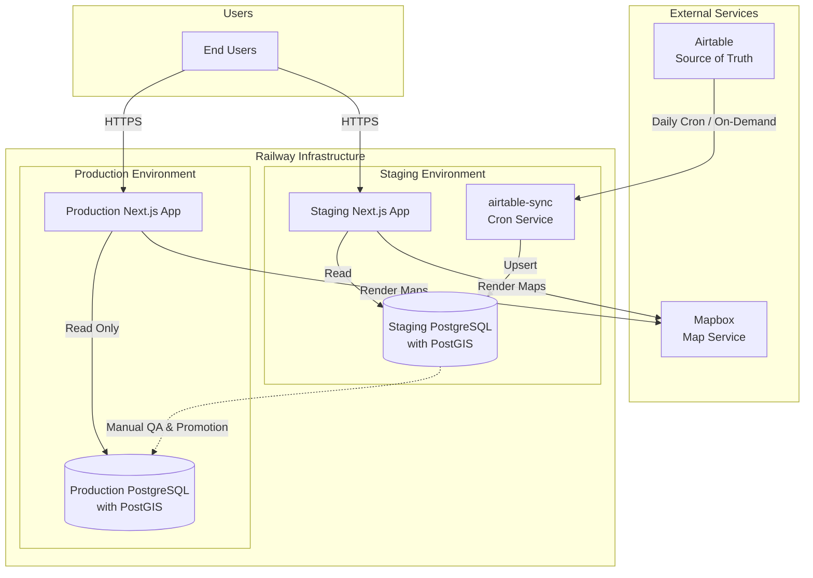

# SA Circular Directory — Architecture & Data Flow

## Guiding Principles

- **Affordable** — avoid services with monthly fees where possible; prefer usage-based or free tiers
- **Accessible** — no technical learning curve for contributors managing data; Airtable UI is the control surface
- **Simple** — minimal moving parts, clear promotion path from staging → production
- **AI-assisted** — leverage AI for sync logic, data mapping, and QA tooling where it reduces manual work

---

## Tech Stack

| Layer | Tool | Why |
|---|---|---|
| Data source of truth | Airtable | Non-technical team can manage data via UI |
| App database | PostgreSQL + PostGIS (Railway) | Free on Railway hobby plan; PostGIS enables future map queries |
| API layer | Raw `pg` pool queries via `src/lib/db.ts` | Prisma was planned but not yet implemented; pg is used directly |
| Frontend + backend | Next.js (App Router) | Monorepo — one repo, one deploy per environment |
| Infrastructure | Railway | Git-based deploys, managed Postgres, environment support, no monthly fee on hobby |
| Maps | Mapbox | Render location data on the frontend |

> **Note:** The tech stack table originally listed Prisma and tRPC — neither is in use yet. The app queries the DB directly via `pg` pool.

---

## System Architecture



---

## Environments

| | Staging | Production |
|---|---|---|
| **Trigger** | Push to `main` branch | Git tag release (e.g. `v1.0.0`) |
| **Database** | Staging PostgreSQL | Production PostgreSQL |
| **Airtable sync** | Daily cron + on-demand via Railway dashboard | Promoted from staging only |
| **Purpose** | QA & verification | Live to end users |

### Deploy flow
```
Airtable UI (data changes)
  └── Daily cron job (airtable-sync service, 0 6 * * * UTC) → Staging DB
        └── QA passes → Manual promotion → Production DB
                            └── Git tag → Production App deploys
```

---

## Airtable

- **Base ID:** `apppd7CyLPeDWBkLz`
- **Primary table:** `Production DB` (table ID: `tblujaqw04RqX2j3P`)
- **Env var:** `AIRTABLE_API_KEY` (stored in Railway, never hardcode)
- **Env var:** `AIRTABLE_BASE_ID` = `apppd7CyLPeDWBkLz` (stored in Railway)

Airtable is **read-only from the app's perspective.** All data edits happen in Airtable. The sync job pulls from Airtable and writes to the staging PostgreSQL database.

### Airtable tables synced

| Airtable Table | Postgres Table | Notes |
|---|---|---|
| `Production DB` | `businesses` | Main listing records |
| `Business Actions` | `business_actions` | Has `Corresponding Action` (user-facing label) and `Order for Display` (sort order) |
| `Categories` | `categories` | |
| `Business Type` | `business_types` | |
| `Core Material System` | `core_material_systems` | |
| `Enabling Systems` | `enabling_systems` | |
| `Tag` | `tags` | |
| `Business Activity` | `business_activities` | |

### Known Airtable field quirks

- **`Listing Photo`** — stored as a plain URL string (not an Airtable attachment array). Extract directly: `f['Listing Photo']`, not `f['Listing Photo'][0].url`.
- **`Business Descriptios`** — typo in Airtable field name ("Descriptios", not "Description"). The sync uses the misspelled name to match.
- **`Type of Business`** — Airtable field name in `Production DB`; the sync references it as `Type of Listing` (legacy mismatch — verify if this causes data loss).
- **`SERVICE Category - Override`** — Airtable field is named `SERVICE - Override or Specific (Unique items or category)`; verify sync field name matches.
- **`Business Actions` → `Action` field** — stores the business-perspective label (e.g. "Accepts Dropoff", "Sells"). The `Corresponding Action` field stores the user-facing label (e.g. "Donate", "Buy"). The app maps between them via `src/lib/actionMapping.ts`.

---

## Data Sync

### How it works

Sync logic lives in `src/lib/sync.ts` and is shared between two entry points:

| Entry point | When to use |
|---|---|
| `scripts/sync.ts` + `npm run sync` | Railway Cron service, or local testing |
| `POST /api/admin/sync` | On-demand HTTP trigger (requires `Authorization: Bearer <SYNC_SECRET>`) |

The sync fetches all 8 Airtable tables into memory, upserts lookup tables in parallel, then upserts businesses. All upserts use `ON CONFLICT (airtable_id) DO UPDATE` so re-running is safe.

### Railway Cron service (`airtable-sync`)

- **Service name:** `airtable-sync` (ID: `1ae4e62e-9793-4678-a2e5-858efe4aeb47`)
- **Schedule:** `0 6 * * *` (6am UTC = midnight CT)
- **Start command:** `npm run sync`
- **Manual trigger:** click "Deploy Now" in the Railway dashboard on the `airtable-sync` service
- **Env vars required:** `DATABASE_URL`, `AIRTABLE_API_KEY`, `AIRTABLE_BASE_ID`, `NODE_ENV=production`

> **`NODE_ENV=production` is required** on the cron service so `src/lib/db.ts` enables SSL for the Railway internal Postgres connection.

### HTTP on-demand trigger

```bash
curl -X POST https://<app-url>/api/admin/sync \
  -H "Authorization: Bearer <SYNC_SECRET>"
```

`SYNC_SECRET` must be set in Railway env vars for the app service. If unset, the endpoint returns 401 for all requests.

### Production promotion (Staging DB → Production DB)

- **Manual step** — run after QA sign-off
- Script: `npm run db:promote` (pg_dump staging → pg_restore production)
- Never auto-promoted; always a deliberate human decision

---

## Database Schema

Schema is managed with plain SQL migration files in `migrations/`. There is no ORM migration runner — apply files manually or via an admin script.

| File | Purpose |
|---|---|
| `migrations/002_simplified_schema.sql` | Full schema for fresh installs (drops and recreates all tables) |
| `migrations/003_add_action_columns.sql` | Incremental: adds `corresponding_action` + `display_order` to `business_actions`, updates `businesses_complete` view |

### Key design decisions

- **PostgreSQL arrays for relationships** — instead of junction tables, `businesses` stores `input_action_ids INTEGER[]`, `tag_ids INTEGER[]`, etc. GIN indexes enable fast array searches.
- **`businesses_complete` view** — joins all array columns to their name strings; this is what `getListings()` queries. Action name arrays are ordered by `business_actions.display_order`.
- **Action name mapping** — `src/lib/actionMapping.ts` maps Airtable action strings to the app's `ActionName` type. `ACTION_ORDER` in `src/lib/getListings.ts` controls display sort order and should mirror `Order for Display` in the `Business Actions` Airtable table.

---

## Railway Setup

- **Project:** `just-recreation` (ID: `cddc4dce-8969-4302-ac5d-68652cc8e132`)
- **Environments:** `staging`, `production`
- **Services (staging):** `sa-circular-directory-app` (Next.js app), `Postgres`, `airtable-sync` (cron)
- **Services (production):** `sa-circular-directory-app`, `Postgres`
- Env vars managed in Railway dashboard — never committed to the repo

### Dependency note

`airtable` and `tsx` must be in `dependencies` (not `devDependencies`) — Railway strips dev deps during production builds, and both are needed at runtime by the cron service.

---

## Actual Repo Structure

```
sa-circular-directory-app/
  src/
    app/                    # Next.js App Router pages
      api/admin/sync/       # POST /api/admin/sync — on-demand sync trigger
    components/             # UI components (ActionIcon, Nav, Pill, etc.)
    lib/
      sync.ts               # Core sync logic (shared between cron + API route)
      db.ts                 # pg Pool singleton
      getListings.ts        # DB → Listing type mapping; queries businesses_complete view
      actionMapping.ts      # Airtable action string → ActionName mapping
  scripts/
    sync.ts                 # Standalone entry point for Railway Cron (calls src/lib/sync.ts)
  migrations/
    002_simplified_schema.sql
    003_add_action_columns.sql
  docs/
    architecture.md         # This file
```

---

## Where AI Makes Sense

| Task | AI Opportunity |
|---|---|
| Airtable schema changes | When new columns are added to Airtable, Claude can update the sync script, migration, `getListings.ts` types, and UI in one pass |
| Sync script logic | Claude writes and maintains the upsert logic as Airtable schema evolves |
| QA diffing | Claude can compare staging vs. production record counts / field changes before promotion |
| Component generation | Claude builds UI components from Figma designs using design tokens (see CLAUDE.md) |
| Data cleanup | Claude can flag Airtable records with missing required fields before sync |
| Field name auditing | Use the Airtable MCP (`describe_table`) + Grep to verify field name alignment between Airtable and sync scripts |
